# Python-Django-寵物電商

## 介紹

- 這是一個利用Django、CSS、HTML、JavaScript、MySQL、Redis完成的購物網站

- 使用的技術及工具

  - 開發環境
    - Python(3.8)

  - 後端:
    - Django(4.0)
      - 第三方登入串接
      - JWT( Json Web Token)
      - Email
      - 第三方金流串接

  - 前端:
    - 從https://www.templatemonster.com/ 中獲取模板，利用HTML、CSS進行修改
    - JavaScript(利用Ajax向後端請求數據)

  - 資料庫
    - MySQL
  - 緩存
    - Redis
  - 爬蟲
    - Selenium
  - 部署
    - nginx

- 功能

  - 提供:
    - 第三方登入(Google、Facebook)
    - Email 寄送驗證碼
    - 個人資訊及送貨地址顯示及修改
    - 訂單及詳細商品顯示
    - 將商品加入購物車(Redis)
    - 建立訂單
    - 第三方金流串接(綠界(測試用))
    - 訂單倒數計時功能(自動修改訂單狀態為已取消(Redis))
  - 商品
    - 庫存顯示(少於20件時顯示)
  - 浪浪資訊
    - 使用Selenium動態爬取[張媽媽流浪動物之家](https://www.ntpsa.org.tw/home)並存入MySQL

## 展示

- 網頁展示：

  - Homepage

    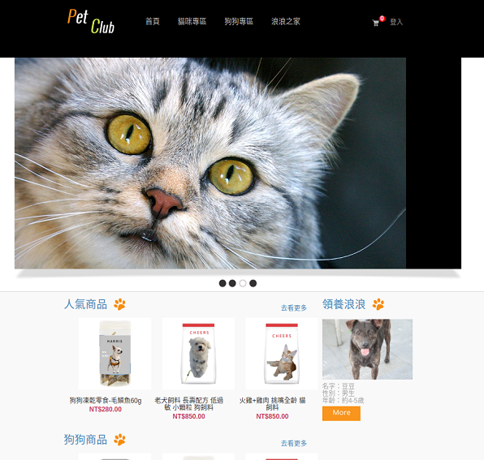

  - Product_list

    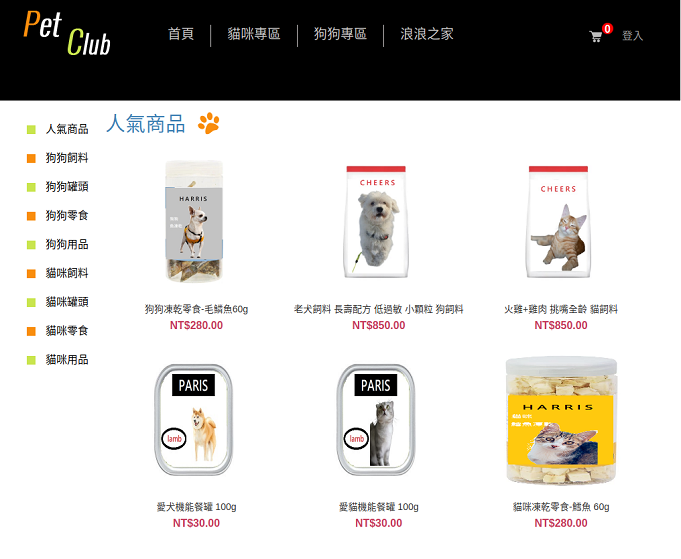

  - Product_list(selected)

    .png)

  - Product_detail

    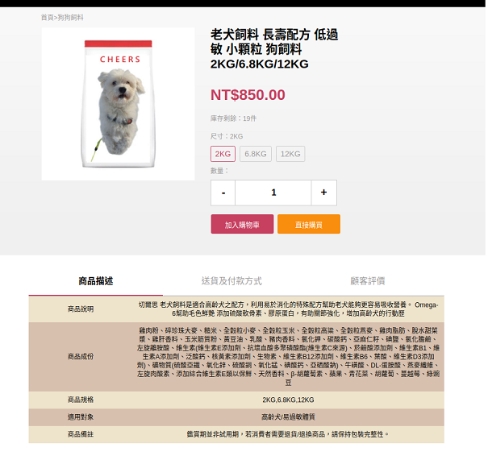
    
  - Product_detail(diff spec)

    .png)
    
  - Cart

    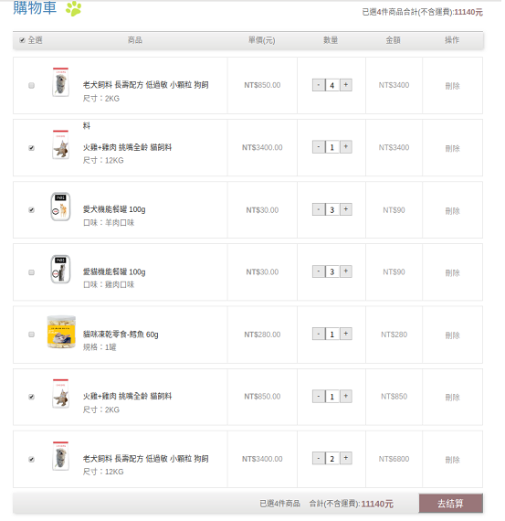
    
  - Order

    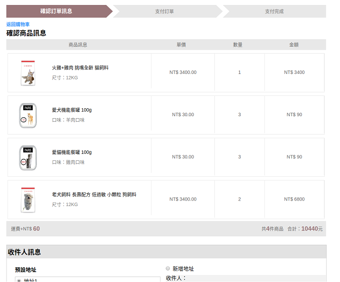
    
    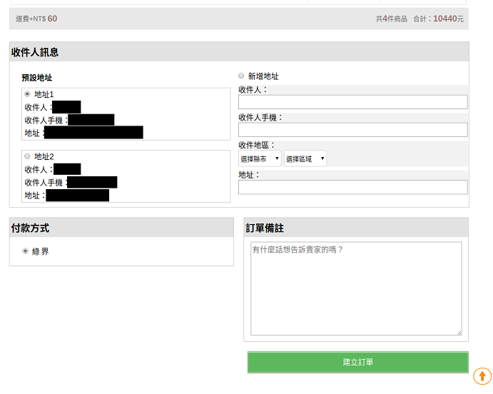
    
  - **Order created** --> Pay --> Pay(Success)

    
    
  - Order created --> **Pay** --> Pay(Success)

    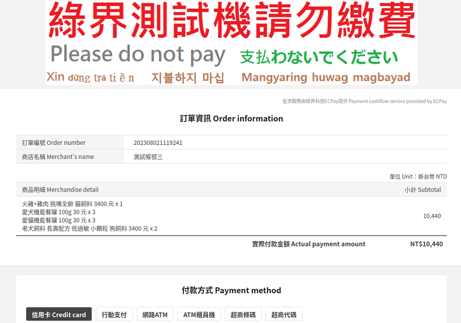
    
    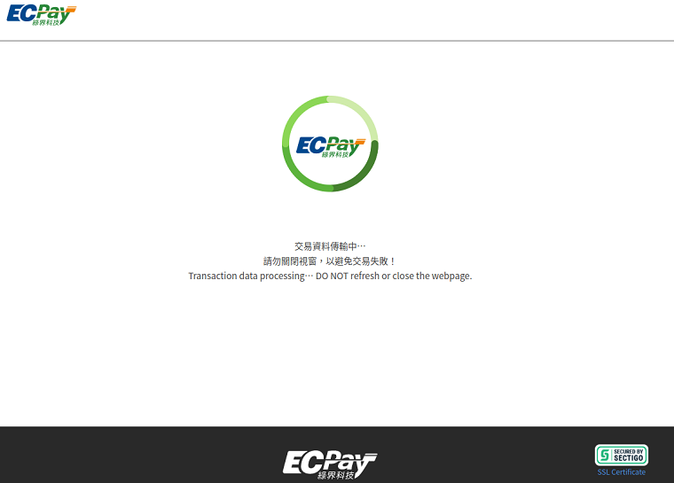
    
  - Order created --> Pay --> **Pay(Success)**

    .png)
    
  - Login

    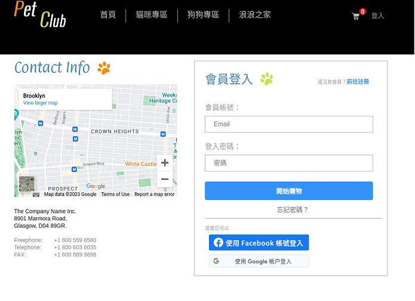
    
  - Login(Google)

    .png)
    
  - Customer Info

     
    
  - Customer Order

    
    
  - Stray animal Info(Selenium)

    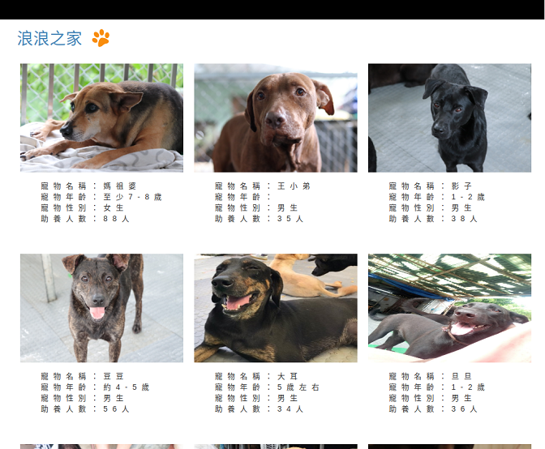
    
    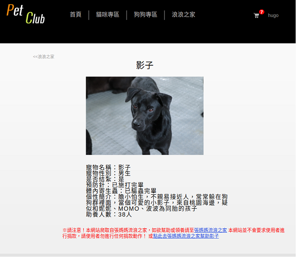
    
    
    
    
    
    
    
    
